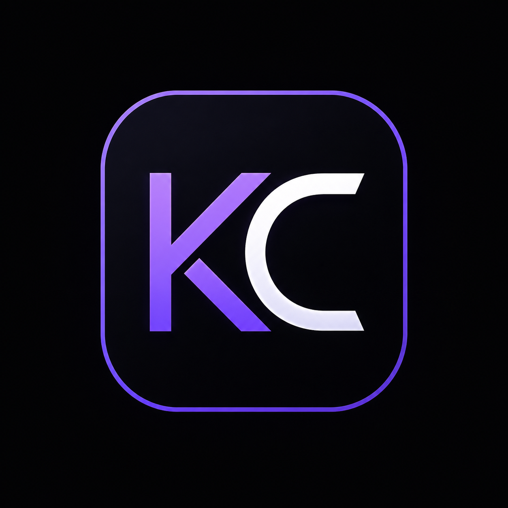

# 🚀 Kanishk Chhachra | AI/ML Engineer & Full-Stack Developer Portfolio

<p align="center">
  
</p>

<h3 align="center">
AI/ML Engineer • Backend Developer • Full-Stack Developer
</h3>

<p align="center">
An immersive, interactive, and visually engaging portfolio built with React, Three.js, Framer Motion, and modern web technologies.
</p>

---

## 🌟 Live Portfolio

🔗 **Portfolio:** https://kanishk-portfolio-delta.vercel.app/

🔗 **LinkedIn:** https://www.linkedin.com/in/kanishk-chhachra-654171276/

🔗 **GitHub:** https://github.com/Kanishk3105

---

# ✨ About This Portfolio

This portfolio is more than a personal website.

It is a modern interactive experience designed to showcase my journey, technical expertise, projects, achievements, and passion for building intelligent software solutions.

The website combines:

* Stunning 3D visuals
* Interactive animations
* AI/ML project showcases
* Responsive design
* Smooth user experience
* Modern UI/UX principles

to create an engaging experience for recruiters, collaborators, and technology enthusiasts.

---

# 🎯 Key Features

## 🚀 Interactive Hero Section

* Dynamic typing animation
* Animated social links
* 3D workspace scene
* Smooth entrance effects
* Responsive layout

---

## 🧠 About Me

Learn about:

* My educational background
* AI/ML journey
* Professional goals
* Technical interests
* Career aspirations

---

## 💻 Technical Skills

Interactive skill showcase featuring:

### Languages

* Python
* Java
* C++
* JavaScript
* SQL

### Frameworks

* React
* Django
* Flask
* Node.js

### AI/ML

* TensorFlow
* PyTorch
* OpenCV
* NLP
* Computer Vision

### Tools

* Git
* Docker
* Linux
* PostgreSQL
* MySQL

---

## 📂 Featured Projects

### ⛽ Fuel Price API

Real-time fuel price tracking platform with:

* REST APIs
* Historical analytics
* Data visualization
* Backend architecture

---

### 🧠 MediVision AI

AI-powered healthcare assistant using:

* Computer Vision
* OCR
* Deep Learning

---

### ✍️ Handwritten AI

Handwritten text recognition system utilizing:

* OCR
* NLP
* Image Processing

---

### 📋 TaskForge

Modern productivity and task management platform with:

* Authentication
* Dashboard Analytics
* Team Collaboration
* Responsive UI

---

## 🏆 Achievements & Certifications

Highlights include:

* NVIDIA AI/ML Training Program
* Professional Certifications
* Technical Workshops
* Hackathons
* Academic Achievements

---

## 💬 Testimonials

Visitors can submit testimonials through an integrated Google Form.

Feedback from:

* Mentors
* Recruiters
* Teammates
* Collaborators
* Industry Professionals

will be showcased here.

---

## 🎨 UI / UX Highlights

### Modern Design Language

* Dark futuristic theme
* Neon accents
* Glassmorphism elements
* Smooth transitions

### Motion Design

* Framer Motion animations
* Interactive hover states
* Scroll-based reveals
* Floating effects

### Accessibility

* Responsive layouts
* Mobile-friendly design
* Optimized navigation

---

## 🛠 Tech Stack

### Frontend

* React.js
* Vite
* React Router

### Styling

* Tailwind CSS
* CSS3
* Responsive Design

### Animation

* Framer Motion
* GSAP

### 3D Graphics

* Three.js
* React Three Fiber
* React Three Drei

### Backend & Database

* Django
* Flask
* PostgreSQL
* MySQL

### AI/ML

* TensorFlow
* PyTorch
* OpenCV
* NumPy
* Pandas

### Tools

* Git
* GitHub
* Docker
* Linux

---

# ⚡ Installation

Clone the repository:

```bash
git clone https://github.com/Kanishk3105/portfolio.git
```

Move into the project directory:

```bash
cd portfolio
```

Install dependencies:

```bash
npm install
```

Start development server:

```bash
npm run dev
```

Build for production:

```bash
npm run build
```

Preview production build:

```bash
npm run preview
```

---

# 📁 Project Structure

```bash
src/
│
├── assets/
├── components/
│   ├── canvas/
│   ├── ui/
│   ├── Hero.jsx
│   ├── About.jsx
│   ├── Works.jsx
│   ├── Contact.jsx
│   └── Feedbacks.jsx
│
├── constants/
├── hoc/
├── reactbits/
├── utils/
│
├── App.jsx
├── styles.js
└── main.jsx
```

---

# 📈 Future Improvements

* Blog Section
* Dynamic Testimonials
* Project Analytics Dashboard
* AI Chat Assistant
* Admin Panel
* Project Filtering
* Multi-language Support

---

# 🤝 Let's Connect

I am actively seeking opportunities in:

* AI/ML Engineering
* Backend Development
* Full-Stack Development
* Software Engineering

📧 Email: [Kanishkchhachra@gmail.com](mailto:Kanishkchhachra@gmail.com)

🔗 LinkedIn: https://www.linkedin.com/in/kanishk-chhachra-654171276/

💻 GitHub: https://github.com/Kanishk3105

---

<p align="center">
Built with ❤️ by Kanishk Chhachra
</p>

<p align="center">
Transforming ideas into intelligent digital solutions.
</p>
